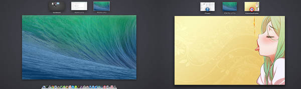

# KonachanFrame
KonachanFrame is a photo frame app that displays images pulled randomly from [konachan.net](http://konachan.net/).  
It's created in [Swift](https://developer.apple.com/swift/), which is an innovative new programming language developed by Apple.

Notice that it **may** pull **Adults Only** images :p

## Keyboard shortcuts
* ⌘S  
  Save an image  
* ⌘C  
  Copy a URL of source file
* ⇧→  
  Display a next image
* ⌘,  
  Open Preferences Window

You can also operate app via menu bar.

## Licence
MIT License  
Copyright (c) 2014 Tsukasa ŌMOTO